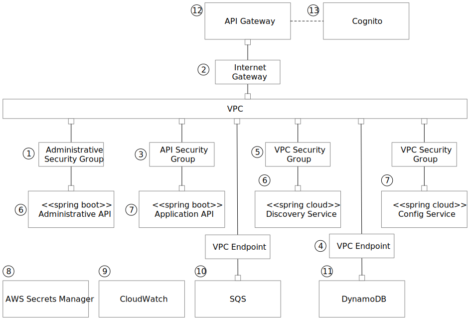

# Template ECS Microservice

This project is template for a microservice using AWS ECS deployed with Terraform. The template includes typical required microservice facilities such as configuration services, logging, and monitoring.

## Project Status

Concept design documentation complete.

## Problem Statement

1. Unneeded configuration diversity threatens security, presents opportunities for errors, generates needless duplication of effort and increases maintenance costs.
2. Although there are significant benefits to leveraging Kubernetes for microservice deployment and management, there are significant obstacles due to the learning curve and the cost of highly-available k8s configurations.
3. Although many examples exist for portions or aspects of a complete microservice, there are no complete end-to-end examples or templates including attention to non-functional requirements, such as monitoring, logging, security and configuration management.

## Solution Summary

* Provide a simple but complete example of a working microservice deployed on a AWS ECS, leveraging security groups and a standalone VPC to isolate the service.
* Provide configurations and examples for non-functional aspects of a microservice, such as secure configuration management, logging, monitoring and typical administrative APIs.
* Leverage cloud native AWS facilities for monitoring and logging.
* Leverage Terraform for deployment facilities.
* Leverage Spring Boot and Spring Cloud for example code, a registry and configuration management services.
* Provide unit tests and stages for all code to support well designed CI/CD pipeline.

## Deployment Diagram

1. *Administrative Security Group* allows inbound administrative API traffic
2. *Internet Gateway* configured to allow Internet traffic to API services.
3. *API Security Group* configured to allow traffic to the functional API endpoints
4. *VPC Endpoints* constrain VPC traffic to private IP interfaces to AWS services
5. *VPC Security Group* allows internal traffic within the VPC
6. *Administrative API* configures and operates administrative and operational traffic
7. *Application API* is the functional API for the microservice
8. *AWS Secrets Manager* stores sensitive information for configuring the service
9. *CloudWatch* aggregates logs from services
10. *SQS* manages asynchronous messaging between microservice components, such as to support CQRS architectures
11. *DynamoDB* provides data services
12. *API Gateway* provides a secure internet endpoint for inbound connections
13. *Cognito* provides API authentication services

## Deployment Steps

<!-- 1. Configure IAM role and API user for deployment and configure AWS Secret with API keys. -->
1. Deploy ECS Cluster.
2. Deploy Spring Configuration Server and Spring Registry Service in ECS Cluster.
3. Deploy DynamoDB, CloudWatch rules and SNS configurations.
4. Deploy Administrative API Service.
5. Deploy Simple Spring Boot API Service.

## Citations and References

This section contains references to a published sources used to develop this project.

* [Example repository to run an ECS cluster on Fargate](https://github.com/Oxalide/terraform-fargate-example). This repository is a Terraform example for deploying the ECS infrastructure. 
* [Break a Monolith Application into Microservices](https://aws.amazon.com/getting-started/projects/break-monolith-app-microservices-ecs-docker-ec2/). An AWS Getting Started project demonstrating how to build a container image for a monolithic node.js application and push it to Amazon Elastic Container Registry.
* [amazon-ecs-nodejs-microservices](https://github.com/awslabs/amazon-ecs-nodejs-microservices). A reference architecture that shows the evolution of a Node.js application from a monolithic application that is deployed directly onto instances with no containerization or orchestration, to a containerized microservices architecture orchestrated using Amazon EC2 Container Service.
* Pluralsight [Spring Cloud Fundamentals](https://www.pluralsight.com/courses/spring-cloud-fundamentals)
* Pluralsight [Spring Boot: Efficient Development, Configuration, and Deployment](https://www.pluralsight.com/courses/spring-boot-efficient-development-configuration-deployment)
